# SimpleSync Companion

!!!Disclaimer: I made the app with the help of AI.

Android companion app for [SimpleSync Server](https://github.com/xluciangit/SimpleSyncServer). Pick which folders to watch, set how often to scan, and it quietly uploads new and changed files in the background.

---

## Screenshots

| Dark | Light |
|------|-------|
| 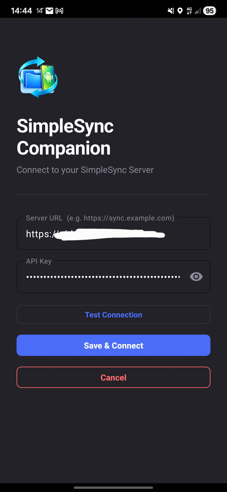 | 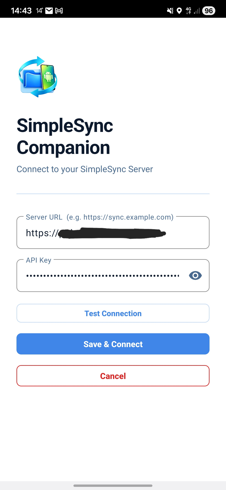 |
| 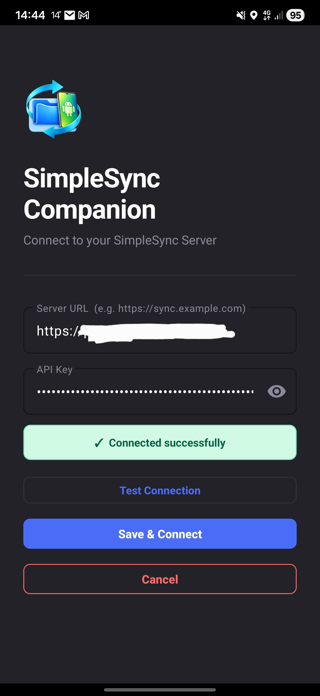 | 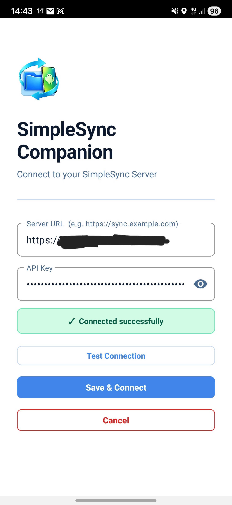 |
| 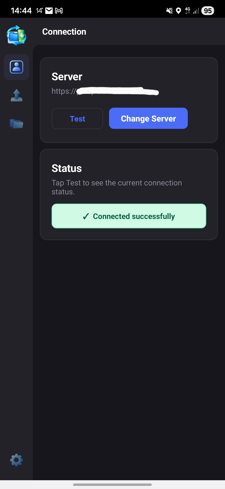 | 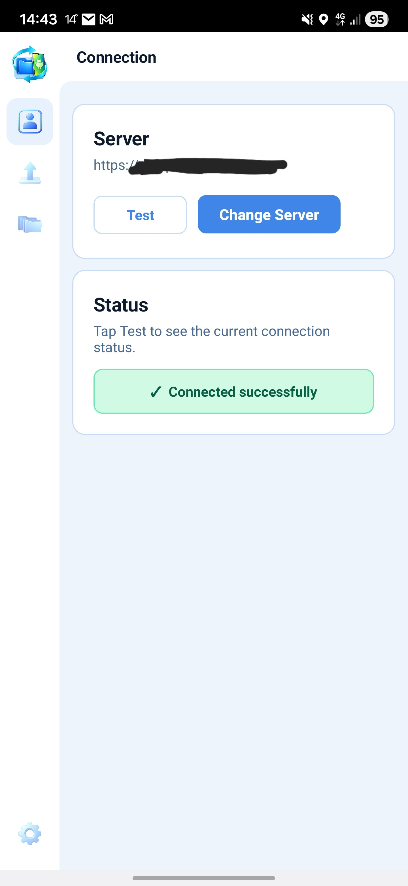 |
| 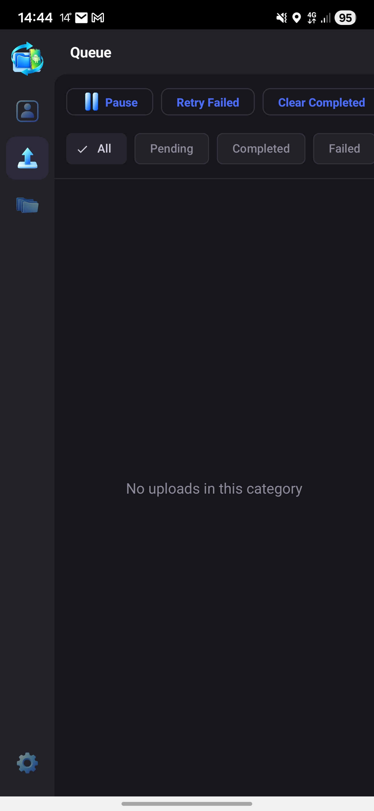 | 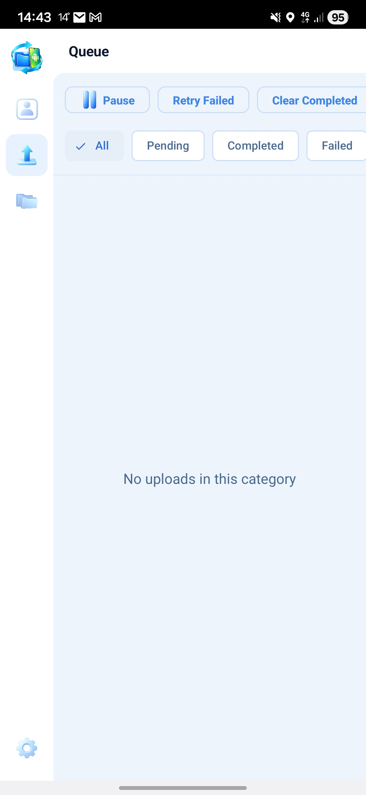 |
| 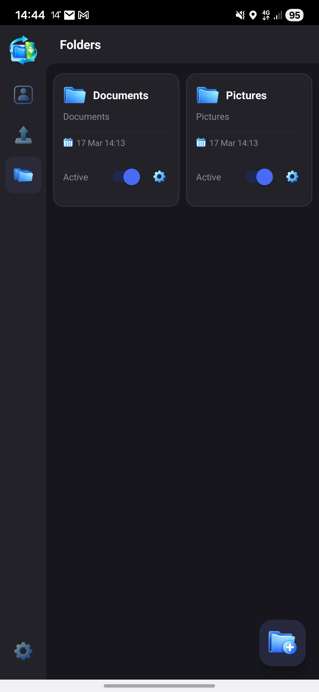 | 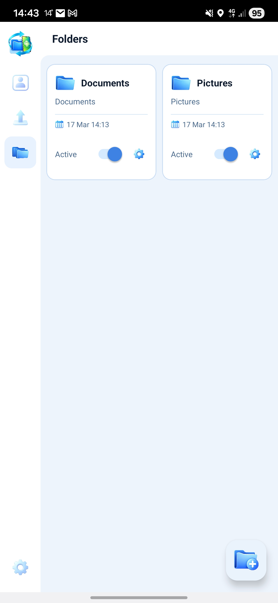 |
| 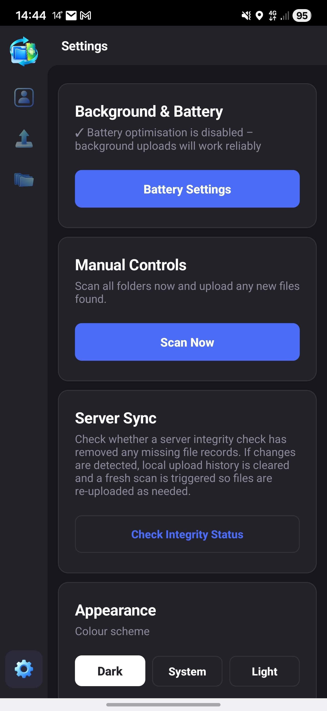 | 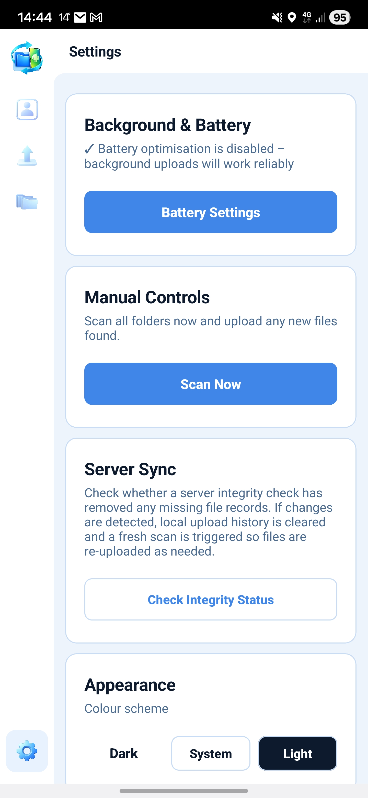 |
| 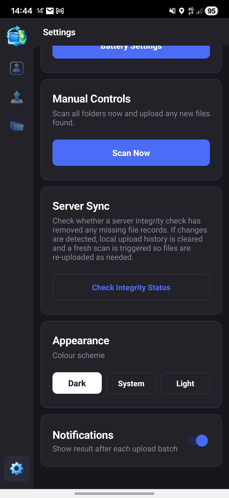 | 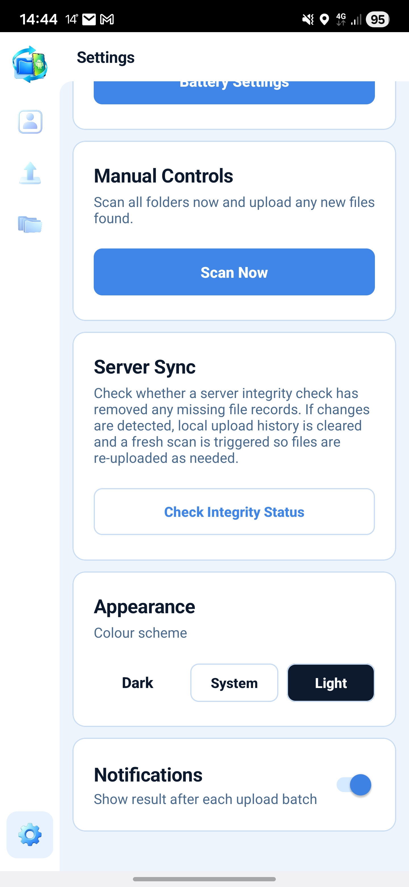 |
| 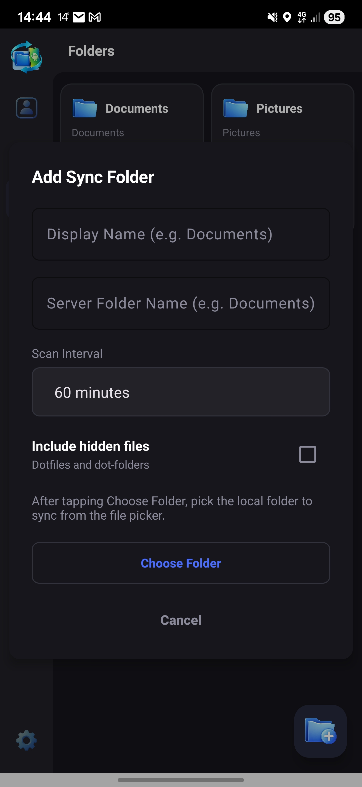 | 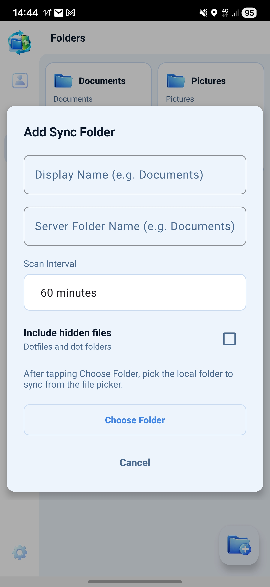 |
| 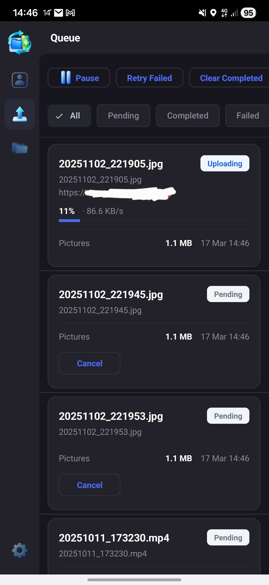 | 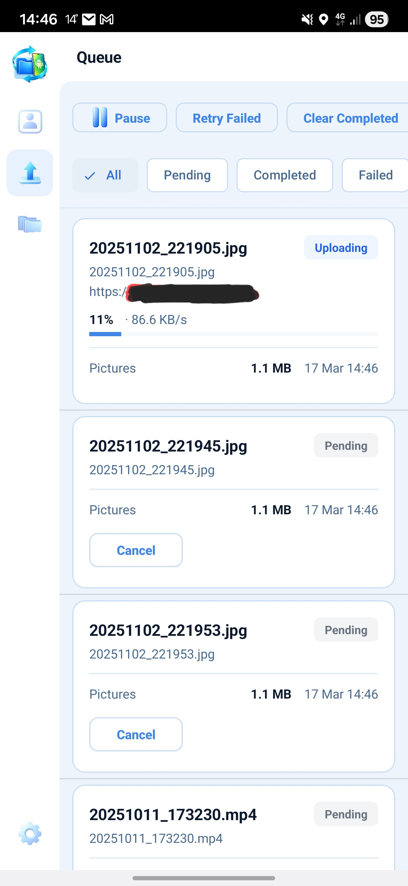 |
| 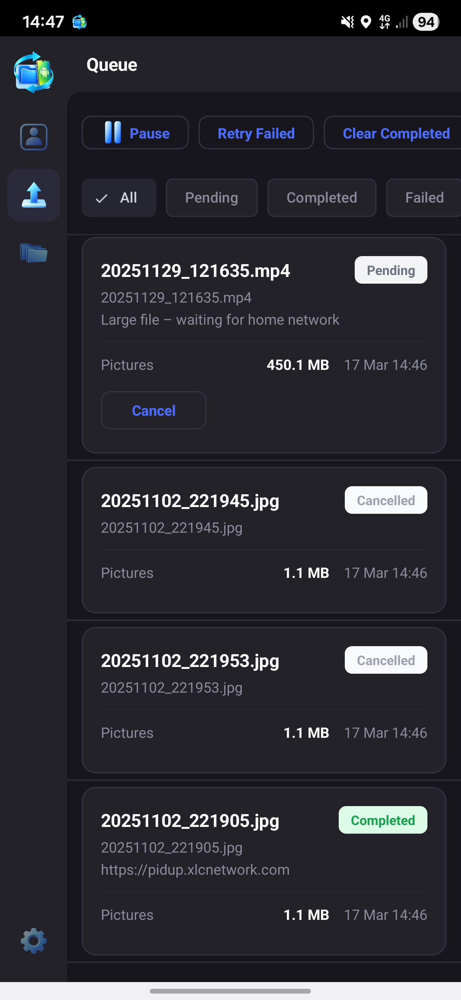 | 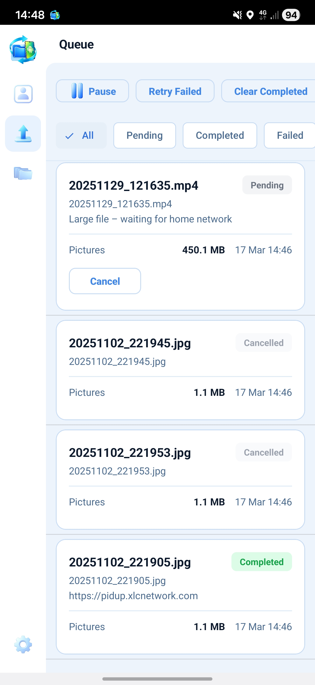 |
| 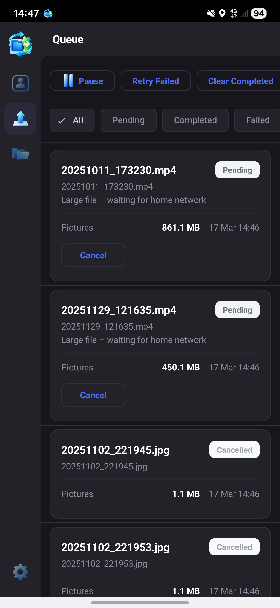 | 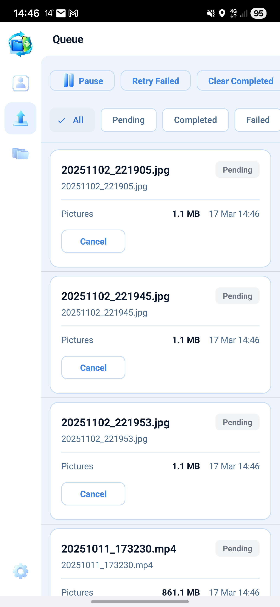 |

---

## What changed in 1.2.1

- 150ms delay between file uploads — prevents rate limit triggers and IP bans when uploading large folders on fast home Wi-Fi
- Fixed: app could close when adding the first folder
- Fixed: upload queue not starting automatically after adding a large folder (third folder onward)
- Connection tab now refreshes the server URL immediately after changing server

---

## What changed in 1.2.0

The UI got a full redesign — new sidebar navigation, custom icons, and a darker theme. Under the hood the main change is API key hashing: keys are now stored as SHA-256 hashes instead of plain text. Existing keys keep working, nothing to change on the server side.

Other changes:
- Connection settings moved to their own tab in the sidebar
- Folders shown as cards in a 2-column grid, each with an Active/Inactive toggle
- Large files over 100 MB now check if the direct URL is reachable before copying and hashing — if you're away from home, the job is set to pending immediately so smaller files can upload without waiting
- Failed uploads are retried once automatically after all other pending jobs finish — only marked permanently failed if it fails again, manual retry is then required
- Changing the server URL or API key asks for confirmation and clears all local folders and queue so they don't sync to the wrong account
- Direct Upload URL is refreshed from the server at the start of every upload run — no need to reconnect after changing the LAN IP in admin settings
- Can't accidentally add two folders pointing to the same server folder
- Completed and skipped jobs auto-clear after 10 minutes
- Write timeout capped at 30 minutes (was unlimited)

---

## Features

- Background sync via WorkManager — runs on a schedule even when the app is closed
- SHA-256 deduplication — files already on the server are skipped, nothing re-uploaded
- Multiple sync folders, each with its own scan interval and hidden file setting
- Large file support — files over 100 MB go via a direct LAN URL to avoid Cloudflare's 100 MB tunnel limit; jobs wait if you're away from home and pick back up when the server is reachable again
- Auto-retry on failure — each failed upload gets one automatic retry before requiring manual action
- Upload queue with per-job progress, speed, and status
- Pause/Resume that survives app restarts
- Dark / light / system theme
- Notifications during scan and on completion
- Reschedules itself after reboot

---

## Requirements

- Android 8.0 (API 26) or above
- A running [SimpleSync Server](https://github.com/xluciangit/SimpleSyncServer) instance
- Network access to that server — local Wi-Fi or Cloudflare Tunnel both work

---

## Installation

### GitHub Releases

Grab the APK from the [Releases page](https://github.com/xluciangit/SimpleSync-Companion/releases). You'll need **Install from unknown sources** enabled — Android Settings → Security.

### Build it yourself

```bash
git clone https://github.com/xluciangit/SimpleSync-Companion.git
cd SimpleSync-Companion
./gradlew assembleRelease
```

---

## Setup

### 1. Get your API key

Log in to SimpleSync Server with a user account (not the admin account). Go to **Settings** and click **Regenerate Key** — copy the key shown.

### 2. Connect the app

The Connection screen appears on first launch. Enter your server URL and API key, tap **Test Connection**, then **Connect**. The app also pulls the Direct Upload URL from the server at this point for large file support.

To change the server later, go to the **Connection** tab in the sidebar.

### 3. Add a sync folder

Go to the **Folders** tab and tap **+**:

- **Display Name** — a label just for you, e.g. `Camera`
- **Server Folder Name** — the folder name on the server, e.g. `Camera`
- **Scan Interval** — how often to check for new or changed files
- **Include hidden files** — off by default; turn on to sync dotfiles
- Tap **Choose Folder** to pick a local directory

A scan starts immediately after adding.

---

## Folder settings

Tap the gear icon on a folder card to change the scan interval, default is set to 60 minutes, toggle hidden file syncing, or remove the folder. Removing it only deletes the local config — files already on the server are not touched.

---

## Upload queue

The Queue tab shows all jobs. Actively uploading files are at the top, followed by pending, failed, cancelled, and completed at the bottom. Completed and skipped jobs clear automatically after 10 minutes.

Each card shows the filename, folder, size, date queued, and status. While uploading you'll also see a progress bar, percentage, live speed, and which URL is being used.

**Buttons:**

| Button | What it does |
|--------|-------------|
| Pause / Resume | Stops or starts all uploads — remembered across app restarts |
| Retry Failed | Resets failed jobs to pending and triggers an upload |
| Clear Completed | Removes completed jobs from the list |
| Clear Cancelled | Removes cancelled jobs from the list |

**Filters:** All · Pending · Completed · Failed · Cancelled

---

## Large files

Cloudflare Tunnel has a 100 MB request limit. To handle bigger files:

1. In SimpleSync Server, log in as admin → Settings → set the **Direct Upload URL** to your server's local address, e.g. `http://192.168.1.100:3000`
2. The app picks this up when you connect and refreshes it before every upload run
3. Files over 100 MB are automatically routed to the direct URL when it's reachable
4. If the direct URL is down (you're away from home), those jobs sit as Pending and resume automatically when you're back on the same network — smaller files in the queue upload normally in the meantime

---

## How uploads work

1. Scanner compares `lastModified` and `fileSize` against the local DB to find new or changed files
2. Each new file gets a Pending upload job
3. For files over 100 MB, the worker pings the direct URL first — if unreachable, the job is deferred and the next file processes immediately
4. For all other files, the worker copies to cache, hashes with SHA-256, and asks the server if it already has that hash
5. Server already has it → job marked Completed, no upload
6. Server doesn't have it → file uploaded via `POST /api/upload`
7. Success → job marked Completed, file recorded in local DB
8. Failure → job gets one automatic retry after all other pending jobs finish; if it fails again it's marked Failed permanently, can be manually retried to upload

The local DB is only updated after a confirmed result, so interrupted uploads always retry safely from the start.

---

## Permissions

| Permission | Why |
|------------|-----|
| `INTERNET` | Upload files to the server |
| `ACCESS_NETWORK_STATE` | Check connectivity before uploading |
| `FOREGROUND_SERVICE` / `FOREGROUND_SERVICE_DATA_SYNC` | Background upload service |
| `WAKE_LOCK` | Keep the device awake during upload |
| `REQUEST_IGNORE_BATTERY_OPTIMIZATIONS` | Prevent Android from killing background uploads |
| `RECEIVE_BOOT_COMPLETED` | Reschedule scanning after reboot |
| `POST_NOTIFICATIONS` | Progress and completion notifications (Android 13+) |

---

## Privacy

No analytics, no tracking, no third-party services. Everything goes directly between your phone and your own server.

---

## Building for release

Generate a keystore if you don't have one:

```bash
keytool -genkeypair -v -keystore release.keystore \
  -alias simplesync -keyalg RSA -keysize 2048 -validity 10000
```

Add to `local.properties` in the project root:

```properties
KEYSTORE_PATH=/path/to/release.keystore
KEYSTORE_PASSWORD=your_keystore_password
KEY_ALIAS=simplesync
KEY_PASSWORD=your_key_password
```

```bash
./gradlew assembleRelease
```

APK lands at `app/build/outputs/apk/release/app-release.apk`.

---

## License

MIT

[](https://ko-fi.com/xlucian)